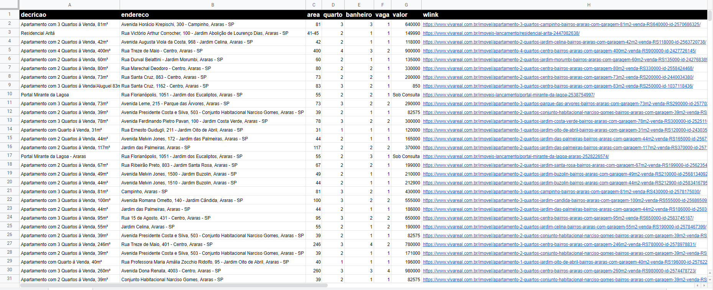

## Objetivo
Extrair informações de todos os imóveis a venda no site [Vivareal](www.vivareal.com.br) em uma cidade específica.

  
  <b>Site Vivareal com filtro de imóveis na cidade de Araras-SP</b>

## Solução proposta
<b>Stacks:</b> Python (requests, bs4, pandas, os e sys)

A arquitetura do Web Scraper obedece etapas hierárquicas, onde primeiramente teremos um raspador que vai indicar quantos imóveis/card's existem para serem acessados, com isso, o programa pode saber quantas páginas ainda pode avançar, os raspadores de dados que vão operar dentro de cada imóvel/card coletara os dados de <b>[decricao]</b>, <b>[endereco]</b>, <b>[area]</b> em metros quadrados, <b>[quantidade]</b> de quartos, quantidade de <b>[banheiros]</b>, quantidade de <b>[vagas]</b>, <b>[valor]</b> e o<b>[link]</b> único do imóvel. É necessário definir o estado e cidade a ser pesquisada no link de requisição.

  
  <b>Dados a serem extraídos</b>

## Resultados
<b>Problemas resolvidos:</b> Durante a análise da página e de seu código HTML, foi constatado que não existe a informação de quantidade de páginas com card's de imóveis na cidade filtrada, para resolver o problema, foi extraído o número de imóveis/card's totais, com essa informação o programa avança trocando de página até que o tamanho do DataFrame seja igual à quantidade de imóveis/card's.

  
  <b>Dados de quantidade de imóveis na cidade filtrada</b>

<b>Métricas de resultado:</b> É possível constatar o correto funcionamento do programa através do número de registros coletados, a quantidade de imóveis informada no site sempre confere com a quantidade de registros no arquivo '.csv' final, também, através de validação manual feita utilizando a cidade de araras como exemplo, é possível constatar a consistência dos dados coletados.

<b>Métricas de performance:</b>  Para garantir o acesso a todas as páginas necessárias, é feito uma verificação em cada requisição, caso a resposta(response) recebida diferir do código 200, o programa para instantaneamente, informa o problema e não salva o arquivo com dados incompletos.

<b>Arquivo final - '.csv':</b>

  
  <b>Dados de imóveis coletados com filtro de cidade igual Araras-SP</b>

## Projetos futuros: 
Como projeto futuro, pode-se ser feito uma análise nos dados, onde será primeiramente extraído uma média geral dos valores, a partir disso identificar os bairros que possuem imóveis com o valor abaixo da média ou acima da média. 